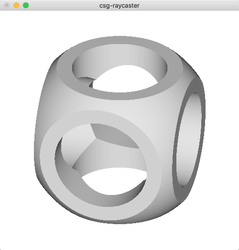

# CSG: constructive solid geometry library

[](https://travis-ci.org/dzhus/csg)
[](https://hackage.haskell.org/package/csg)
[](http://packdeps.haskellers.com/feed?needle=csg)

CSG is a [constructive solid geometry][csg-wiki] library with support
for ray casting. CSG allows you to define a complex solid as a
composition of primitives. It also provides functions to perform ray
casting (find an intersection of a ray and the defined solid) or test
whether a point belongs to the solid (for Monte Carlo volume
calculation).

```haskell
-- "Data.CSG" uses 'Vec3' to represent vectors and points:
>>> let p1 = fromXYZ (5, -6.5, -5)
>>> toXYZ (origin :: Point)
(0.0,0.0,0.0)

-- Define some solids:
>>> let s = sphere origin 5.0
>>> let b = cuboid (fromXYZ (-1, -1, -1)) (fromXYZ (1, 1, 1))

-- Test if a point is inside the solid:
>>> origin `inside` (s `intersect` b)
True

>>> origin `inside` (s `subtract` b)
False

-- Find the distance to the next intersection of a ray with a solid, along with the
-- surface normal:
>>> let axis = fromXYZ (1, 2, 10)
>>> let solid = cylinder origin axis 2.0 `intersect` sphere origin 3.5
>>> let ray = Ray (p1, origin <-> p1)
>>> ray `cast` solid
Just (HitPoint 0.7422558525331708 (Just (CVec3 0.7155468474912454 (-0.6952955216188516) 6.750441957464598e-2)))

-- Load a solid definition from a file:
>>> import Data.CSG.Parser
>>> Right solid2 <- parseGeometryFile "examples/reentry.geo"
>>> ray `cast` solid2
Just (HitPoint 10.877824491509912 (Just (CVec3 (-0.5690708596937849) 0.7397921176019203 0.3589790793088691)))
```

Please consult the [Hackage page for csg][hackage-doc]
for full documentation.

By default `csg` is built using `CVec3` from [simple-vec3][] to
represent vectors and points, which according to benchmarks shows
better performance with Unboxed and Storable vectors. Build `csg` with
`triples` flag to use `(Double, Double, Double)` instead which may be
a more convenient programmatic interface that needs no
`fromXYZ`/`toXYZ`.

See [alternatives](#alternatives) too.

## csg-raycaster

The package also includes `csg-raycaster` executable, which is a
simple interactive GUI for the ray casting algorithm.

`csg-raycaster` takes a geometry defintion file as input. See
[`cube.geo`](examples/cube.geo):

```
solid box = orthobrick (-150, -150, -150; 150, 150, 150);

solid rounded = sphere (0, 0, 0; 200);

solid roundedbox = rounded and box;

solid cylinder1 = cylinder (-160, 0, 0; 160, 0, 0; 100);
solid cylinder2 = cylinder (0, -160, 0; 0, 160, 0; 100);
solid cylinder3 = cylinder (0, 0, -160; 0, 0, 160; 100);

solid cross = cylinder1 or cylinder2 or cylinder3;

solid cutout = not cross;

solid top = roundedbox and cutout;

tlo top;
```

Please consult the [Hackage page for Data.CSG.Parser][parser-doc] for
full format specification.

`csg-raycaster` may be run as

```
csg-raycaster cube.geo
```

Run as `csg-raycaster --help` to see all options.



When run without a file argument, `csg-raycaster` will try to display
an arbitrary CSG solid.

In the GUI window the following controls are supported:

| Input                     | Function                             |
|---------------------------|--------------------------------------|
| Left mouse button + drag  | Rotate                               |
| Right mouse button + drag | Pan                                  |
| Mouse wheel up            | Zoom in                              |
| Mouse wheel down          | Zoom out                             |
| `r`                       | Reset zoom level and camera position |

## Alternatives

csg library performs no surface interpolation when doing ray casting.
Instead, we only solve ray-surface intersection equation numerically.
The library was written with Repa/vector compatibility and performance
in mind.

There're other Haskell libraries for CSG:

- [GlomeTrace][]:

    - Has more ray tracing-specific features, such as light sources,
      different textures and materials.

    - Unlike `csg`, has no tests or benchmarks.

    - In `csg` solids use the same type as opposed to different types
      with an existential box in `GlomeTrace`.

- [implicit][]:

    - Offers a much richer operation set.

    - Uses function representation for CSG solids.

    - If `implicit` had ray-casting support in early 2012 then I
      probably wouldn't write `csg`.

- [mecha][]:

    - Only provides types and functions to define solids and export
      definitions to external formats.

    - No support for ray casting.

[csg-wiki]: https://en.wikipedia.org/wiki/Constructive_solid_geometry
[hackage-doc]: http://hackage.haskell.org/package/csg/docs/Data-CSG.html
[implicit]: https://hackage.haskell.org/package/implicit
[mecha]: https://hackage.haskell.org/package/mecha
[parser-doc]: http://hackage.haskell.org/package/csg/docs/Data-CSG-Parser.html
[simple-vec3]: https://hackage.haskell.org/package/simple-vec3
[glometrace]: https://hackage.haskell.org/package/GlomeTrace
